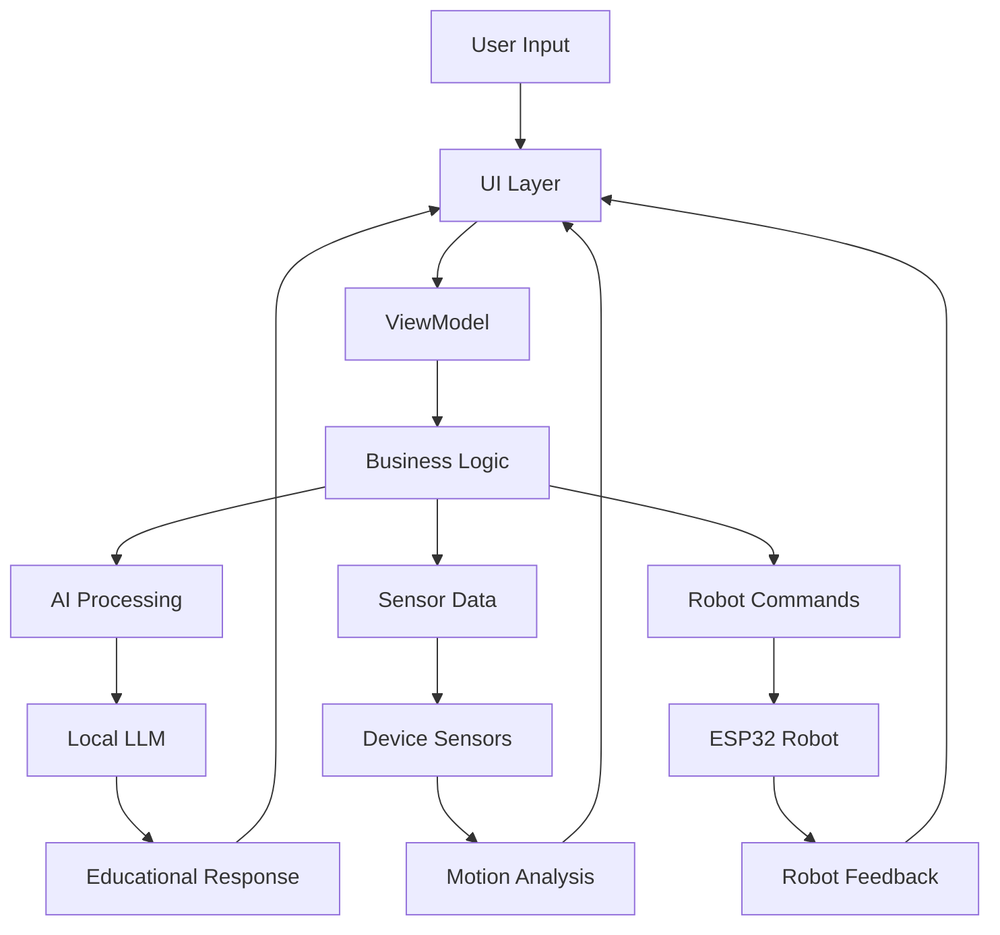

# 🤖 SmartBot - Educational Robot with Local LLM Integration

[](https://opensource.org/licenses/MIT)
[](https://developer.android.com)
[](https://kotlinlang.org)
[](https://www.espressif.com/en/products/socs/esp32)

> **🎓 Transform your smartphone into an intelligent educational robot platform**

SmartBot is an innovative Android application that combines the power of local AI processing with physical robotics to create engaging educational experiences. By leveraging your smartphone's capabilities and connecting to an ESP32-based robot, SmartBot provides hands-on STEM learning opportunities while maintaining privacy through local LLM processing.

## ✨ Key Features

### 🧠 **Local AI Integration**
- **TinyLLaMA, Phi-2, Mistral**: Run powerful language models locally on your device
- **Privacy-First**: All AI processing happens on-device, no data sent to cloud
- **Educational Conversations**: Context-aware tutoring across multiple subjects
- **Adaptive Learning**: Adjusts difficulty based on user interaction

### 🎤 **Voice Interaction**
- **Speech Recognition**: Natural voice commands and questions
- **Text-to-Speech**: AI responses with natural voice synthesis
- **Multi-language Support**: Educational content in multiple languages
- **Real-time Processing**: Low-latency voice interaction

### 📱 **Advanced Sensor Integration**
- **Motion Detection**: Accelerometer, gyroscope, magnetometer
- **Environmental Sensing**: Light, proximity, temperature sensors
- **Educational Analytics**: Real-time motion analysis and physics demonstrations
- **Calibration System**: User-friendly sensor calibration tools

### 🔗 **Dual Robot Communication**
- **Bluetooth Classic**: Reliable short-range communication
- **WiFi HTTP**: Extended range with REST API control
- **Real-time Control**: Low-latency robot command execution
- **Status Monitoring**: Live feedback from robot sensors and systems

### 👁️ **Computer Vision**
- **Object Detection**: ML Kit powered recognition and classification
- **Face Detection**: Educational facial landmark analysis
- **Text Recognition**: OCR for educational content scanning
- **Educational Descriptions**: AI-generated explanations of detected objects

## 🚀 Live Demo

**🌐 Try the Interactive Web Demo:** [SmartBot Demo](https://work-1-qoopbakykigaxbyb.prod-runtime.all-hands.dev)

Experience the full SmartBot interface in your browser! The web demo showcases:
- 📱 Complete mobile UI with Material Design 3
- 🤖 Interactive AI chat with educational responses
- 📊 Real-time sensor data visualization
- 🎮 Robot control interface with directional commands
- 🔄 Live connection and status monitoring

## 📁 Project Structure

```
SmartBot/
├── 📱 app/                          # Android Application
│   ├── src/main/
│   │   ├── java/com/smartbot/
│   │   │   ├── 🧠 ai/              # Local LLM Integration
│   │   │   │   ├── LLMManager.kt           # Model loading & inference
│   │   │   │   └── ConversationManager.kt  # Educational conversations
│   │   │   ├── 🎤 voice/           # Speech Processing
│   │   │   │   ├── SpeechRecognitionManager.kt
│   │   │   │   └── TextToSpeechManager.kt
│   │   │   ├── 📊 sensors/         # Device Sensors
│   │   │   │   └── SensorManager.kt        # Motion & environmental data
│   │   │   ├── 🔗 comm/            # Robot Communication
│   │   │   │   ├── BluetoothManager.kt     # Bluetooth connectivity
│   │   │   │   └── WiFiManager.kt          # WiFi HTTP communication
│   │   │   ├── 👁️ vision/          # Computer Vision
│   │   │   │   ├── CameraManager.kt        # Camera operations
│   │   │   │   └── ObjectDetectionManager.kt # ML Kit integration
│   │   │   ├── 🎨 ui/              # User Interface
│   │   │   │   ├── screens/                # Jetpack Compose screens
│   │   │   │   ├── theme/                  # Material Design 3 theme
│   │   │   │   ├── viewmodel/              # MVVM ViewModels
│   │   │   │   └── SmartBotApp.kt          # Main app component
│   │   │   └── MainActivity.kt             # Application entry point
│   │   ├── res/                    # Android Resources
│   │   └── AndroidManifest.xml     # App configuration
│   └── build.gradle                # Dependencies & build config
├── 🔧 esp32_firmware/              # Robot Firmware
│   ├── smartbot_robot.ino          # Arduino ESP32 code
│   └── README.md                   # Hardware setup guide
├── 🌐 web_demo/                    # Interactive Web Demo
│   ├── index.html                  # Demo interface
│   ├── styles.css                  # Material Design styling
│   ├── script.js                   # Interactive functionality
│   └── server.py                   # Demo web server
├── 📚 Documentation
│   ├── README.md                   # This file
│   ├── PROJECT_SUMMARY.md          # Comprehensive project overview
│   └── LICENSE                     # MIT License
└── ⚙️ Configuration
    ├── build.gradle                # Project configuration
    ├── settings.gradle             # Gradle settings
    └── gradle.properties           # Build properties
```

## 🏗️ Architecture Overview

SmartBot follows a modular, clean architecture pattern with clear separation of concerns:

### 🧩 Core Modules

| Module | Purpose | Key Components |
|--------|---------|----------------|
| 🧠 **AI** | Local LLM processing | `LLMManager`, `ConversationManager` |
| 🎤 **Voice** | Speech interaction | `SpeechRecognitionManager`, `TextToSpeechManager` |
| 📊 **Sensors** | Device sensor integration | `SensorManager`, calibration system |
| 🔗 **Communication** | Robot connectivity | `BluetoothManager`, `WiFiManager` |
| 👁️ **Vision** | Computer vision | `CameraManager`, `ObjectDetectionManager` |
| 🎨 **UI** | User interface | Jetpack Compose screens, ViewModels |

### 🔄 Data Flow



## 🛠️ Quick Start

### 📋 Prerequisites

**Android Development:**
- Android Studio Arctic Fox (2020.3.1) or newer
- Android SDK 21+ (Android 5.0 Lollipop)
- Kotlin 1.9.10 or newer
- 4GB+ RAM device (for LLM models)

**Hardware (Optional):**
- ESP32 development board
- L298N motor driver
- 2x DC geared motors
- HC-SR04 ultrasonic sensor
- Robot chassis and battery pack

### 🚀 Installation

1. **Clone the Repository**
   ```bash
   git clone https://github.com/yourusername/SmartBot.git
   cd SmartBot
   ```

2. **Open in Android Studio**
   - Launch Android Studio
   - Select "Open an existing project"
   - Navigate to the SmartBot directory

3. **Sync Dependencies**
   ```bash
   ./gradlew build
   ```

4. **Run the App**
   - Connect your Android device or start an emulator
   - Click "Run" in Android Studio

### 🔧 ESP32 Robot Setup (Optional)

1. **Hardware Assembly**
   - Follow the wiring diagram in `esp32_firmware/README.md`
   - Connect motors, sensors, and power supply

2. **Flash Firmware**
   ```bash
   # Using Arduino IDE
   # 1. Install ESP32 board support
   # 2. Open esp32_firmware/smartbot_robot.ino
   # 3. Select your ESP32 board and port
   # 4. Upload the firmware
   ```

3. **Connect to App**
   - Enable Bluetooth on your Android device
   - Open SmartBot app
   - Tap "Connect" and select "SmartBot_ESP32"

## 🎓 Educational Applications

### 📚 Learning Domains

| Subject | Features | Example Activities |
|---------|----------|-------------------|
| 🔢 **Mathematics** | Interactive problem solving, visual demonstrations | Geometry with robot movements, algebra through sensor data |
| 🔬 **Science** | Physics experiments, data collection | Motion studies, force analysis, environmental monitoring |
| 💻 **Programming** | Code concepts, algorithm visualization | Loop demonstrations, conditional logic with robot behavior |
| 🤖 **Robotics** | Mechanics, control systems | Motor control, sensor integration, autonomous navigation |
| 🌍 **Physics** | Real-world applications | Acceleration, rotation, momentum through device sensors |
| 🗣️ **Language** | Vocabulary, conversation practice | AI-powered language learning, pronunciation feedback |

### 🎯 Teaching Methods

- **🗣️ Interactive Dialogue**: AI-powered conversations adapt to learning pace
- **🤲 Hands-on Learning**: Physical robot demonstrations reinforce concepts
- **👀 Visual Learning**: Object recognition and analysis enhance understanding
- **🏃 Kinesthetic Learning**: Motion-based activities engage multiple senses
- **📈 Adaptive Difficulty**: Personalized learning progression

### 🏆 Difficulty Levels

- **🟢 Beginner**: Simple concepts with guided explanations
- **🟡 Intermediate**: More detailed information and problem-solving
- **🔴 Advanced**: Complex topics with analytical thinking

## 🔧 Technical Specifications

### 📱 Android Requirements

| Component | Requirement | Purpose |
|-----------|-------------|---------|
| **OS Version** | Android 5.0+ (API 21) | Core functionality |
| **RAM** | 4GB+ recommended | LLM model loading |
| **Storage** | 2GB+ free space | Models and app data |
| **Connectivity** | Bluetooth 4.0+, WiFi | Robot communication |
| **Sensors** | Accelerometer, Gyroscope | Motion detection |
| **Camera** | 2MP+ | Computer vision features |
| **Microphone** | Built-in | Voice recognition |

### 🔗 Communication Protocols

**Bluetooth Classic (SPP)**
- Range: ~10 meters
- Latency: <50ms
- Use case: Real-time robot control

**WiFi HTTP/REST**
- Range: ~30 meters
- Bandwidth: High
- Use case: Data transfer, status monitoring

### 🧠 Supported AI Models

| Model | Size | RAM Required | Features |
|-------|------|--------------|----------|
| **TinyLLaMA** | 1.1B params | 2GB | Fast inference, basic conversations |
| **Phi-2** | 2.7B params | 4GB | Advanced reasoning, code generation |
| **Mistral-7B** | 7B params | 8GB | Complex conversations, detailed explanations |

## 🛠️ Dependencies & Technologies

### 🏗️ Core Framework
```kotlin
// UI Framework
implementation "androidx.compose.ui:compose-ui:1.5.4"
implementation "androidx.compose.material3:material3:1.1.2"
implementation "androidx.navigation:navigation-compose:2.7.4"

// Architecture
implementation "androidx.lifecycle:lifecycle-viewmodel-compose:2.7.0"
implementation "androidx.activity:activity-compose:1.8.0"
```

### 🧠 AI & ML
```kotlin
// Local LLM (via JNI)
implementation "ai.djl.android:core:0.24.0"

// Computer Vision
implementation "com.google.mlkit:object-detection:17.0.0"
implementation "com.google.mlkit:face-detection:16.1.5"
implementation "com.google.mlkit:text-recognition:16.0.0"
```

### 🔗 Communication
```kotlin
// HTTP Client
implementation "com.squareup.okhttp3:okhttp:4.12.0"
implementation "com.squareup.retrofit2:retrofit:2.9.0"

// JSON Processing
implementation "com.google.code.gson:gson:2.10.1"
```

### 📱 Android Features
```kotlin
// Camera
implementation "androidx.camera:camera-camera2:1.3.0"
implementation "androidx.camera:camera-lifecycle:1.3.0"

// Sensors & Bluetooth
implementation "androidx.core:core-ktx:1.12.0"
```

## 🤖 ESP32 Robot Commands

### 🎮 Movement Commands
```bash
MOVE:F:100    # Move forward at 100% speed
MOVE:B:50     # Move backward at 50% speed  
MOVE:L:75     # Turn left at 75% speed
MOVE:R:75     # Turn right at 75% speed
MOVE:S:0      # Stop movement
```

### ⚙️ Motor Control
```bash
MOTOR:50:-30  # Left motor 50%, right motor -30%
```

### 📊 Sensor Requests
```bash
SENSOR:ALL         # Request all sensor data
SENSOR:ULTRASONIC  # Request distance sensor data
```

### 💡 LED Control
```bash
LED:255:0:128  # Set RGB LED (red:255, green:0, blue:128)
```

### 🎭 Special Commands
```bash
DANCE    # Execute dance routine
SPIN     # Spin in place
PATROL   # Execute patrol pattern
STOP     # Emergency stop
```

## 🔐 Required Permissions

| Permission | Purpose | Required |
|------------|---------|----------|
| `CAMERA` | Computer vision features | Optional |
| `RECORD_AUDIO` | Voice recognition | Optional |
| `BLUETOOTH` | Robot communication | Required |
| `BLUETOOTH_CONNECT` | Device pairing | Required |
| `BLUETOOTH_SCAN` | Device discovery | Required |
| `ACCESS_FINE_LOCATION` | Bluetooth scanning | Required |
| `INTERNET` | WiFi communication | Optional |
| `WAKE_LOCK` | Continuous operation | Optional |

## 🧪 Testing & Development

### 🔬 Running Tests
```bash
# Unit tests
./gradlew test

# Instrumented tests (requires device/emulator)
./gradlew connectedAndroidTest

# Lint checks
./gradlew lint
```

### 🐛 Debugging Tips
1. **Voice Recognition**: Test in quiet environments first
2. **Sensor Calibration**: Place device on flat surface for calibration
3. **Robot Connection**: Ensure ESP32 is powered and in range
4. **AI Performance**: Monitor memory usage with large models

### 📝 Code Quality
- **Kotlin Style**: Follow official Kotlin coding conventions
- **Architecture**: MVVM pattern with clean separation
- **Testing**: Aim for 80%+ code coverage
- **Documentation**: Document all public APIs

## 🤝 Contributing

We welcome contributions! Here's how to get started:

### 🚀 Quick Contribution Guide
1. **Fork** the repository
2. **Create** a feature branch: `git checkout -b feature/amazing-feature`
3. **Commit** your changes: `git commit -m 'Add amazing feature'`
4. **Push** to branch: `git push origin feature/amazing-feature`
5. **Open** a Pull Request

### 🎯 Contribution Areas
- 📚 **Educational Content**: New learning modules and activities
- 🔧 **Hardware Integration**: Additional sensors and actuators
- 🧠 **AI Models**: Optimized educational language models
- 🎨 **UI/UX**: Enhanced user interface and experience
- 📖 **Documentation**: Improved guides and tutorials

### 📋 Development Setup
```bash
# Clone your fork
git clone https://github.com/yourusername/SmartBot.git

# Create development branch
git checkout -b feature/your-feature

# Install pre-commit hooks (optional)
pip install pre-commit
pre-commit install
```

## 🗺️ Roadmap

### 🎯 Version 1.1 (Q2 2024)
- [ ] Additional LLM model support (Gemma, CodeLlama)
- [ ] Enhanced computer vision capabilities
- [ ] Improved robot control algorithms
- [ ] Performance optimizations

### 🚀 Version 1.2 (Q3 2024)
- [ ] Multi-language support (Spanish, French, German)
- [ ] Advanced educational content library
- [ ] Cloud synchronization options
- [ ] Collaborative learning features

### 🌟 Version 2.0 (Q4 2024)
- [ ] AR/VR integration for immersive learning
- [ ] Advanced AI tutoring with personalization
- [ ] Multi-robot coordination capabilities
- [ ] Professional educator dashboard

## 📞 Support & Community

### 🆘 Getting Help
- 📖 **Documentation**: Check this README and project wiki
- 🐛 **Issues**: [GitHub Issues](https://github.com/yourusername/SmartBot/issues)
- 💬 **Discussions**: [GitHub Discussions](https://github.com/yourusername/SmartBot/discussions)
- 📧 **Email**: smartbot-support@example.com

### 🌟 Community
- 🐦 **Twitter**: [@SmartBotEdu](https://twitter.com/SmartBotEdu)
- 💼 **LinkedIn**: [SmartBot Project](https://linkedin.com/company/smartbot)
- 📺 **YouTube**: [SmartBot Tutorials](https://youtube.com/smartbot)

## 🏆 Acknowledgments

Special thanks to the amazing open-source community:

- 🦙 **[llama.cpp](https://github.com/ggerganov/llama.cpp)** - Local LLM inference
- 👁️ **[Google ML Kit](https://developers.google.com/ml-kit)** - On-device ML
- 🤖 **[Android Open Source Project](https://source.android.com/)** - Mobile platform
- 🔧 **[ESP32 Community](https://www.espressif.com/)** - Hardware ecosystem
- 🎨 **[Material Design](https://material.io/)** - Design system

## 📄 License

This project is licensed under the **MIT License** - see the [LICENSE](LICENSE) file for details.

```
MIT License - Feel free to use, modify, and distribute!
```

---

<div align="center">

**🌟 Star this repository if you find it helpful! 🌟**

Made with ❤️ for education and learning

[⬆️ Back to Top](#-smartbot---educational-robot-with-local-llm-integration)

</div>